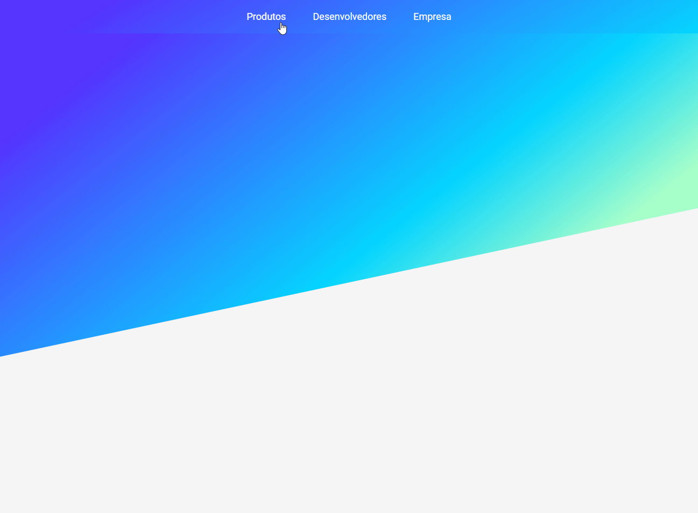

   

  <h1>Clone do menu do Stripe  </h1>
   

Clone reproduzindo a animação do menú do stripe.

[Referencia Youtube Rocketseat](https://www.youtube.com/watch?v=B7V0q0ZSz2o)

 

  

 

  

## Features

- ⚛️ **React** — A web framework for Node Js.
- 📘 **CSS** — CSS is a language that describes the style of an HTML document.
- 📘 **Hooks** — useState, useCallback, useEffect, useLayoutEffect, useRef, useContext, useMemo.
- 📘 **Framer Motion** — A production-ready motion library for React. Utilize the power behind Framer, the best prototyping tool for teams. Proudly open source..

## Getting started

Describe here the way to use/install your project

1. Clone this repo using `https://github.com/Laerciosantosn/Clone-Menu-Stripe.git`
2. Move yourself to the appropriate directory: `cd Clone-Menu-Stripe` 
3. Run `code .` to open project in VsCode 

#### Getting started with the backend server

1. Run `yarn` to install the packages dependecies

#### Getting started with the frontend

1. Run `yarn start` to start the web application
2. In your browser open `http://localhost:3000` to start the web application

## License

This project is licensed under the MIT License - see the [LICENSE](https://opensource.org/licenses/MIT) page for details.
